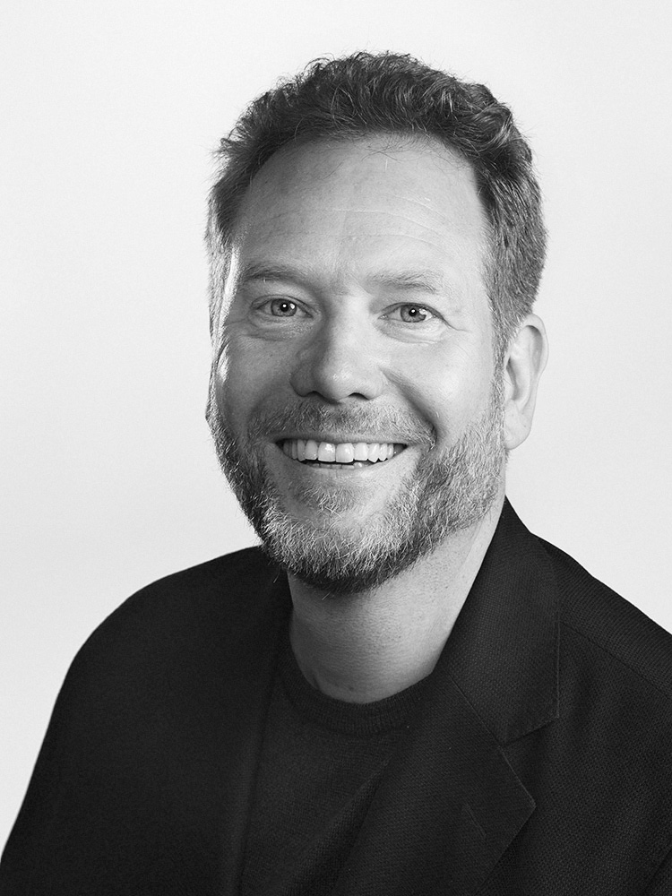

# Erik Happi Stenman 
Consultant, Happi Hacking AB

<a href="happi@happihacking.se">happi@happihacking.se</a>
| <a href="http://linkedin-com/in/happi">+46 735 04 74 42</a>

## Profile

Erik is an experienced technology and business leader, especially within FinTech and communication services.
He is also one of the world's most experienced Erlang developers. He has been programming Erlang since 1994; as a master's student, a doctoral student in the HiPE research group at Uppsala University, a CSO and CTO at Klarna, and now a senior developer in several customer projects. Erik started programming in 1980 and started his first company in 1989.

As one of the very first employees at Klarna Erik started in 2005 as a development manager. Following the company's enormous expansion, Erik's responsibilities grew, and he soon became CTO, a role he combined with active participation in system development. He was the driving force behind the development and design of Klarna's main business system.

The knowledgeable and competent team that Erik built at Klarna created, with a deep understanding of the business model, a distributed financial system with the highest possible accessibility and robustness requirements.
The work included:
- automated risk assessment of credit and fraud
- data modeling and data replication
- robustness and stability
- operational monitoring
- real-time performance optimization

In 2014, Erik went on to start several companies, including Happi Hacking. Since then, with his in-depth knowledge and extensive experience, he has contributed greatly to several projects, for example as a senior developer and architect in a large European blockchain project.

In addition to this, Erik has also written "The BEAM book" and articles about Erlang, presented his research at several academic conferences and workshops, and was awarded the "Erlang User of the Year" during his time in the HiPE research group.
He was also the project leader for the group that developed the first version of Scala and a university lecturer, especially in compiler technology. 

## Specialized in

•	Performance optimization
•	Organizational expansion
•	Internationalization
•	Design and develop new systems/services based on high robustness, scalability, and performance demands.
•	Validation of code and system design based on business and product demands.
•	Data modeling
•	Back-end development

## Experience

`2014 - now`
__Founder, CEO, and consultant of Happi Hacking AB__ 

### Assignments

`November 2021 – now`
__Architect, PM, PO for a Mobile game, HappiHacking__
													 
Helping the team to deliver a new mobile puzzle game. Wrote the solver for the puzzles in C.
__Tools:__ C, Erlang, Flutter, Github projects

`November 2022 – now`
__CTO Kindio AB, a startup in stealth mode__
Building a new startup.

`November 2022 – December 2022`
__C++ Developer AI Startup in stealth mode__
Analysing ML models in MLIR and llvm.
__Tools:__ Python, C++, llvm, PyTorch, TensorFlow, MLIR

`August 2021 – January 2023`
__Technical and Business Advisor, Sika Health__
Architecture and team building for the US payment system.

`June 2021 – November 2022`
__Interim CTO, Laya Technologies__
Architecture and team building for German travel packaging system.

`September 2021`
__Due Diligence Analyst, Kayamo Group Ltd__
Analysis of architecture, data models, and code for a Philippine Bank.
__Tools:__ PHP

`2020 - 2022`
__Architect & project manager,  Deutsche Telekom__
													 
Architecture for video conference, video on demand, and co-watching system.

__Tools:__ UML, Java, MQTT (EMQX), Rabbit MQ, Docker, Kubernetes, AWS, Postgres, Git, Gitlab, WebRTC

`2020 - 2021`
__Due Diligence Analyst, TidyApp__
												
Analysis of architecture, data models, and code.
__Tools:__ Docker, Kubernetes, AWS, Postgres, Git, Gitlab

`2020 - 2020`
__Senior developer, architect, and project manager, Deutsche Telekom__
											 
Architecture and data models for the user and home configuration.

`2019 - 2020`
__Senior developer, architect Deutsche Telekom__
Responsible for the development of a data pipeline capable of handling 1 billion events per day in a secure, GDPR-compliant, and efficient manner.
Tools: Erlang, Kafka, Docker, Kubernetes, AWS, Postgress, Git, Gitlab

`2017 – 2019`
__Senior developer, architect, æternity__
									            			
æternity is a major European collaboration project that develops a blockchain, see aeternity.com. Erik was part of the core team and designed and developed a new blockchain in Erlang. He also implemented a version of EVM and designed FATE, a new, safer virtual machine for smart contracts.   
__Tools:__ Erlang, Git, Github, Pivotal Tracker, Quick Check, Dialyzer, Circle CI

`2015 - 2020` 
__CTO, Doorling AB__
													
Doorling develops a web platform for real estate agents to better match objects with customer needs, using AI and machine learning. 
__Tool:__ AWS, Machine Learning, Erlang 

### Other engagements

`2014-2020`
__CEO, system architect, and senior developer, Happi Studios__
Erik has various roles and works with web services and configuration management, web servers, API development, database design, design of pluggable engine for game rule support, and with frontend work for websites and games.

`2013 - now`
__CEO and founder of Vexilla__
Vexilla is Erik’s family office holding company.

`2020 - now`
__CEO and founder of Profitch__
Profitch is a holding company.

`2016 - now`
__Chairman of the board of CABACO (Carvutto & Barattini & Company)__
Food import and distribution.

`2018 - now`
__Chairman of the board Team Mejeri AB__
Artisan cheese production.

`2021 - now`
__Chairman of the board A.S Ekonomi AB__
An accounting firm.

`2010 - 2014`
__Chief Scientist, Klarna AB__
Worked as an Erlang magician and evangelist who spread the word about Erlang and scalable development both inside and outside Klarna. Led the efforts for scalability and stability in Klarna's system.

`2005 - 2010`
__CTO, Klarna AB__
Handled all tasks related to the expansion of Klarna’s development department from 1 to 80 people. At the same time, Erik led the development and operation of Klarna's payment system with high requirements for availability and robustness 24/7. A critical part was the performance increase in the system, to meet the exponentially increasing business needs of Klarna.

`2004 - 2005`
__Developer, Virtutech AB__
Further development and optimization of the product Virtutech Simics, a complete computer simulator at the cycle level. 

## Education (by selection)

`2003 – 2004`
__Postdoc, EPFL__
Ecole polytechnique fédérale de Lausanne (EPFL) is a university and research institute in Lausanne, Switzerland, specializing in science and technology. As a postdoc for Martin Odersky, Erik gave compiler technology courses and was also the project manager for the team that developed Scala.

`1997 – 2002`
__PhD, Uppsala University__
As a Ph.D. student, Erik developed both Jericho, the first native code compiler for Erlang, and HiPE, the first version of the second native code compiler for Erlang. 
He also made performance measurements, registry allocation, and garbage collection designs.

`1992 – 1997`
__MSc Computer Science, Uppsala University__

## Previous work
Erik started working with computers in 1988 for companies in Haparanda like __Norrfrys__, __Polarica__, __Tuab__, and __Paritet__. In 1989 he started his first consultancy company __EJDA__ where he also worked until he finished his Ph.D. in 2002. Working for numerous customers including __Ericsson__.

<!-- ### Footer

Last updated: January 2023 -->

